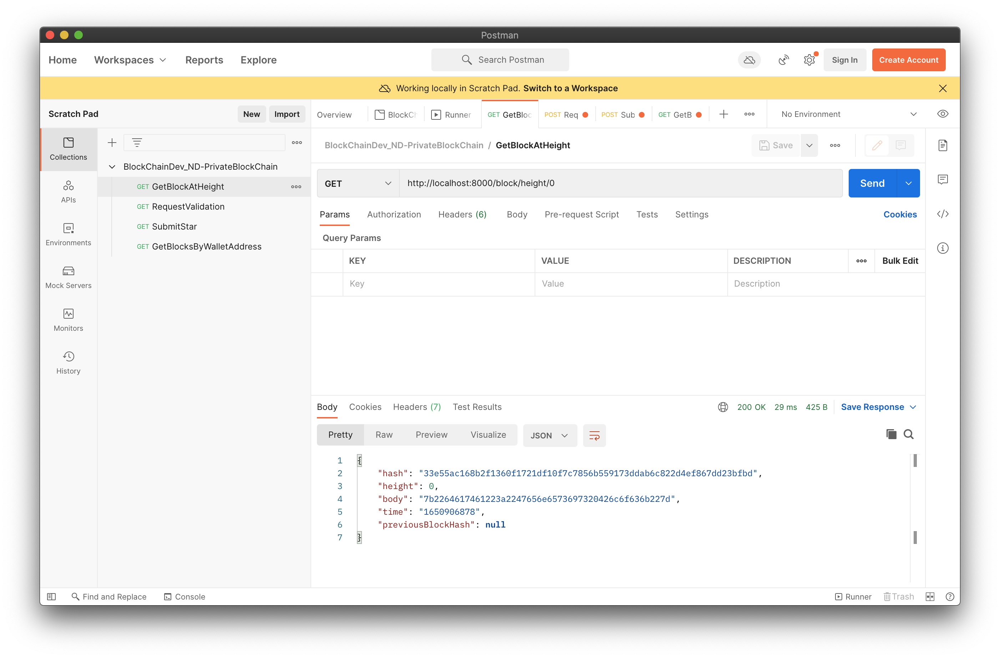
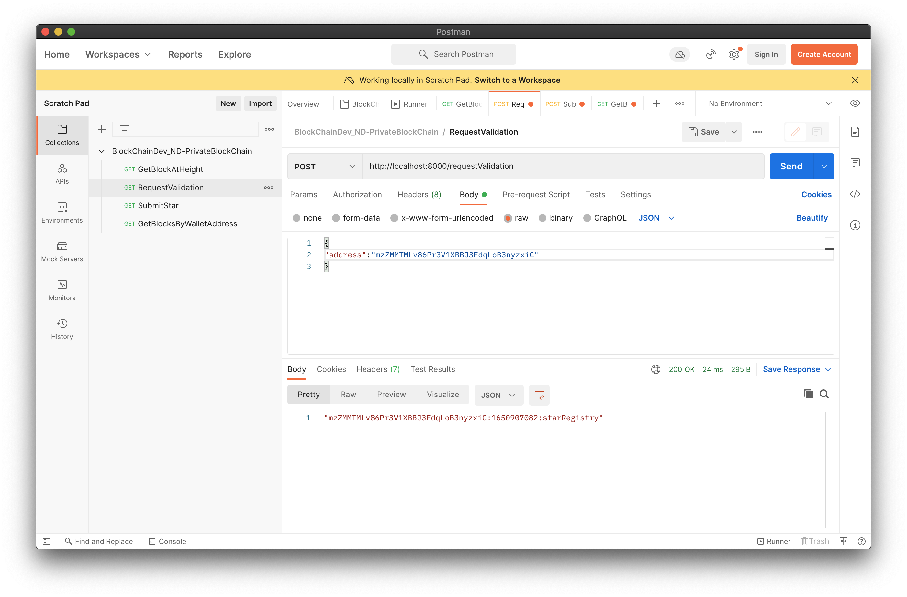
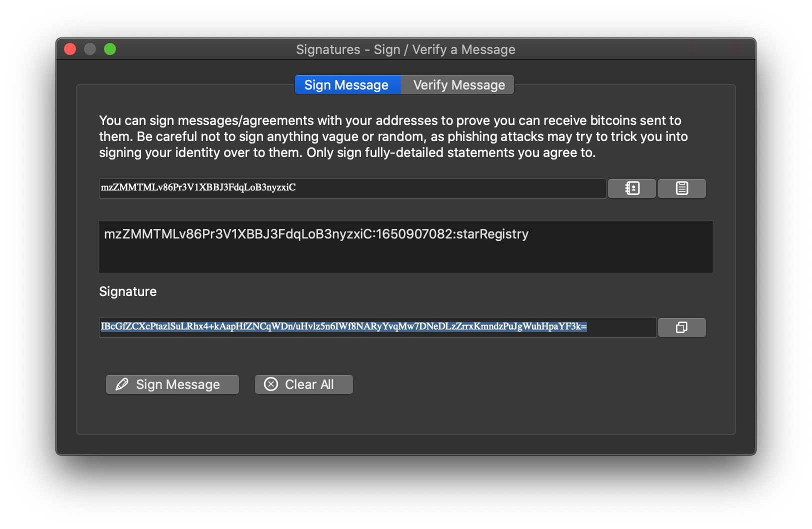
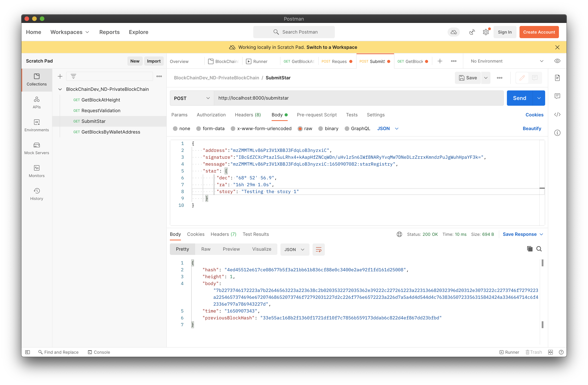
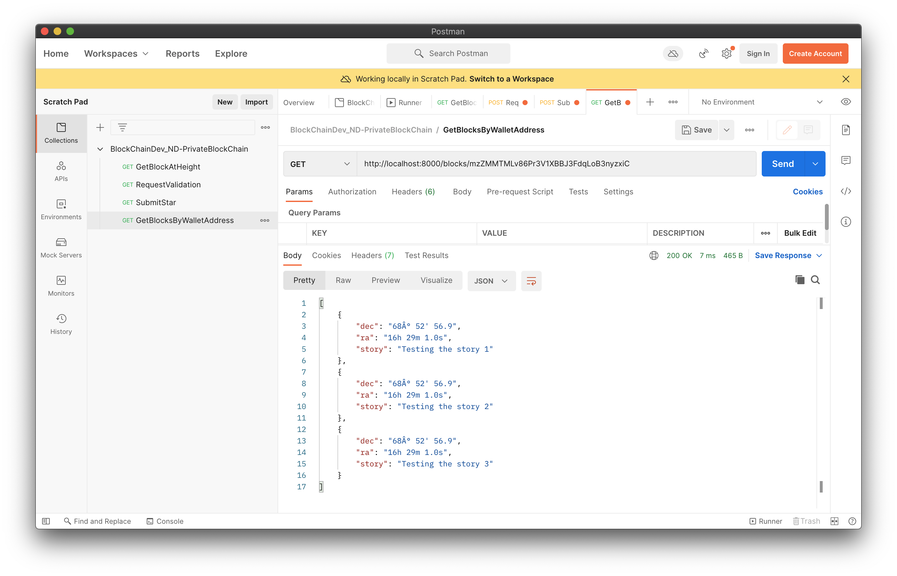
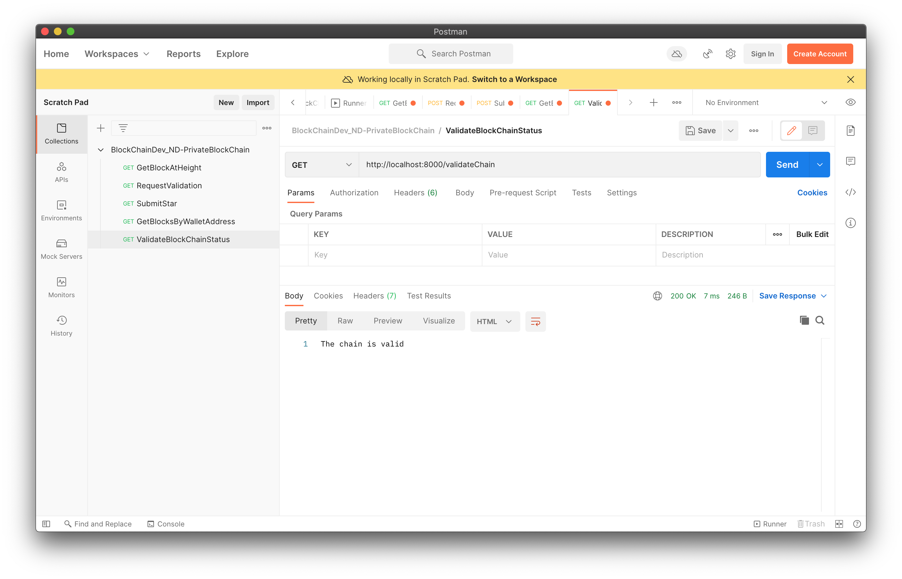

Test results' screenshots

1. Use a GET call to request the Genesis block:
    
2. Use a POST call to requestValidation:
    
3. Sign message with your wallet:
    
4. Submit your Star
     
5. Use GET call to retrieve starts owned by a particular address
    
6. Create an endpoint that will trigger the execution of validateChain()
    